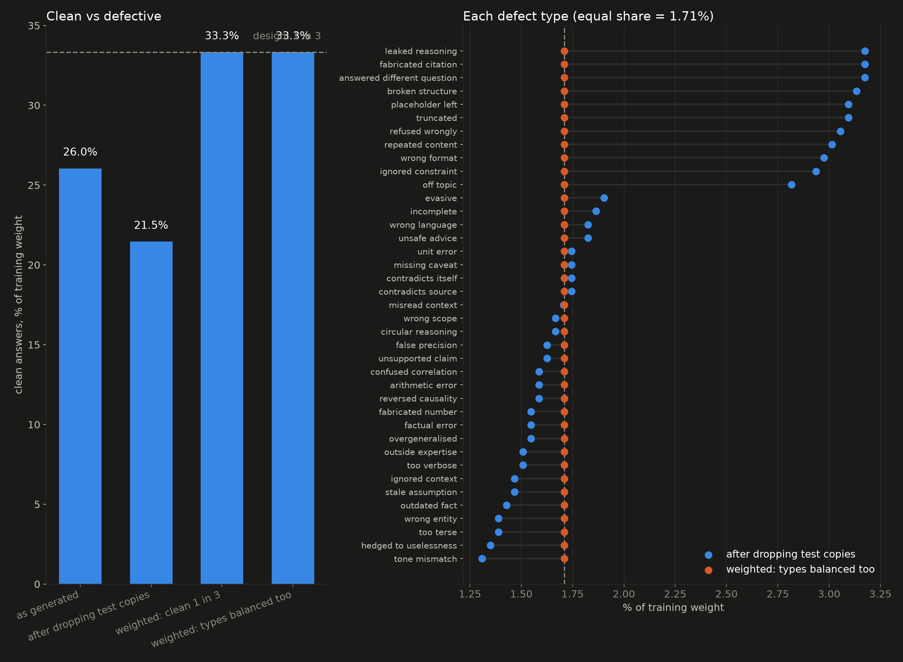

# Fine-tuning Laya on a grading job

Laya (Convai, 421M parameters, Apache-2.0) is fine-tuned to grade AI-written answers: pass or
rework, and which of 40 failure modes. It is scored against Jev (TypeSafe, hosted) on the same
500 held-out items. Measured on an Apple M4 Pro, 25 Sep 2026; `finetune_laya.ipynb` walks through
every step.

| 500 held-out items, vs the planted answer key | Laya out of the box | Laya fine-tuned (2 seeds) | Jev |
|---|---|---|---|
| pass / rework | 0.350 | **0.942 to 0.958** | 0.842 |
| which of 40 failure modes | 0.208 | 0.628 to 0.640 | **0.654** |
| one call, median | 38.6 to 43.2 ms (local) | 38.6 to 43.2 ms (local) | 109.6 to 159 ms (hosted, incl. network) |

Both engines get the same items and the same short option labels; Jev was re-run in the
notebook on 25 Sep 2026 (0.838 on pass/rework in the recorded take) and timed answer by answer on
26 Sep (`jev_timing.py`: 0.842, 500 answers in 67.7 s, $0.0103). Jev's scores move by about a point
between runs, and its latency with the network. Laya's latency moves by a few ms on a busy laptop.

The fence: training and test items come from the same generator, and Jev saw none of them. This
shows a small model **specialised on your task** beating a general one **on that task**, which is
what Laya's model card says it is for. On the 40-option question Jev still leads, narrowly.

## The lesson: transform the data in visible steps, and check the mix after every one

Most of the gains came from the data, not the training code. Three things went wrong, and each
one was invisible until the mix was measured.

**1. The training set contained the test set.** Haiku repeats itself inside a topic: of its
first 998 training questions, 87 matched a test question exactly and 284 were near-copies (0.8
or more similarity after normalising). Training on a reworded test question teaches the answer,
not the task. `prepare_data.py` drops every one before anything else happens.

**2. That clean-up broke the class mix.** Clean questions are generic, so they were the ones
Haiku repeated: 188 of the 284 near-copies were clean answers. After dropping them, training ran
about 20% clean against the one in three the data was generated with, and the model learned the
wrong prior. The fix is weighting back to the design (`--mix design`).

**3. Adding data broke it again, one level down.** 40 natural examples for 11 defect types
doubled their share of training. The test set holds 107 items of those types; the model named
them 125 times and was right on only 65 of those picks (52%, against 74 to 81% before). Its
40-option score fell from 0.63 to 0.60 even though those 11 types improved. Weighting clean vs
defective did not catch it; weighting every defect type to an equal share does (`--mix balanced`).

The rules that come out of it:

- **Drop test copies first**, by similarity, not only by exact match.
- **Measure the mix after every change to the data**: clean vs defective, and type by type.
  A filter changes it, and so does adding data.
- **Take the target mix from how production looks** (here, how the data was generated), never
  from the test set's labels.
- **If you planted the labels, you already have them.** A paid judge agreed with the planted
  labels on 92% of verdicts and 68% of failure modes; it is a quality check, not a requirement.
- **Make the check part of training.** `train.py` prints and plots the mix it is about to train
  on, and refuses to start on a skewed one.



## Pipeline

```bash
# 1. data: combine sources, drop test copies, show the mix at each stage
python prepare_data.py --out data/train_all.jsonl --plot plots/mix_train_all.png \
    data/train_judged.jsonl data/train_dropped_near_test.jsonl data/hybrid_haiku.jsonl data/hybrid.jsonl

# 2. train: re-checks the mix first (runs/<name>/mix.png), ~85 min on an M4 Pro
python train.py --train data/train_all.jsonl --mix design --out runs/all2082

# 3. score on the 500 held-out items
python evaluate.py base
python evaluate.py runs/all2082
```

| File | Does |
|---|---|
| `build_train_set.py`, `build_hybrid.py`, `inject_defects.py` | generate training items with planted labels (Haiku, plus code templates for surface defects) |
| `prepare_data.py` | the data transformation: combine, drop test copies, weight to the design |
| `mix_report.py` | the class-mix table, plot and pre-flight check |
| `finetune_data.py` | rows to Laya training sequences, via Laya's own `build_sequence` |
| `train.py`, `calibrate.py` | single-GPU port of Convai's fine-tuning notebook, plus its temperature fit |
| `evaluate.py` | scoring on the held-out items, on the `laya-mlx` runtime |
| `nb_helpers.py`, `build_notebook.py` | the notebook, and the Jev run on the same items |
| `jev_timing.py` | Jev answer by answer on the 500 items: each pick, clock and token count (`runs/jev_verdict_timed.json`) |

`TYPESAFE_API_KEY` and `ANTHROPIC_API_KEY` go in `.env` (copy `.env.example`; ignored by git).

**The fine-tuned model is not distributed.** Checkpoints (`runs/*/`, ~840 MB each) are not in this
repo. Train your own with step 2 (about 85 minutes on an M4 Pro); the scores ours produced are in
`runs/eval_*.json`, and the notebook's scoring cells expect your checkpoint at `runs/all2082`.
